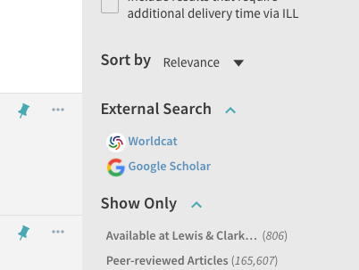

# primo-explore-external-search


[](https://www.npmjs.com/package/primo-explore-external-search)

## Features
A facet is added to the top of the sidebar with options for transferring the user's search to an external target, such as WorldCat or Google Scholar. The options can be configured with custom text, images, and functions to translate Primo's search query into the target's query syntax.

### Screenshot


## Install
1. Make sure you've installed and configured [primo-explore-devenv](https://github.com/ExLibrisGroup/primo-explore-devenv).
2. Navigate to your template/central package root directory. For example:
    ```
    cd primo-explore/custom/MY_VIEW_ID
    ```
3. If you do not already have a `package.json` file in this directory, create one:
    ```
    npm init -y
    ```
4. Install this package:
    ```
    npm install primo-explore-external-search --save-dev
    ```

## Usage
Once this package is installed, add `externalSearch` as a dependency for your custom module definition.

```js
var app = angular.module('viewCustom', ['externalSearch'])
```
Note: If you're using the `--browserify` build option, you will need to first import the module with:

```javascript
import 'primo-explore-external-search';
```
You can configure the options available by passing an array of search target objects. Each object needs five properties:

| param     | type         | usage                                                                                                                |
|-----------|--------------|----------------------------------------------------------------------------------------------------------------------|
| `name`    | string       | the name to display for the target                                                                                   |
| `url`     | string (url) | the base URL to which a Primo query transformed by `mapping()` will be appended                                      |
| `img`     | string (url) | a URL to an icon representing the target
| `alt'     | string       | provide alternative text of images for screen readers
| `mapping` | function     | a function to translate Primo queries and filters to the target's syntax. will receive an array of queries and an array of filters. |

### Mappings

A mapping function will always be passed an array of queries (e.g. 'any,contains,dogs') and filters (e.g. 'pfilter,exact,articles'). For an advanced search, these will also contain an operator such as AND or OR. The example below is the structure from an advanced search where any field contains 'dogs' and the author field starts with 'me' and the material type is set to 'articles'.

```js
queries = [
    'any,contains,dogs,AND',
    'creator,begins_with,me,AND'
]
filters = [
    'pfilter,exact,articles,AND'
]
```

It is up to the mapping function to parse these arrays and take action with them. Ultimately, the function should `return` a value, which will be appended to the end of the `url` property. One approach, as in the example below, is to match parts of the queries and filters to lookup tables using `split()`. If the mapping function is particularly complex, it may be prudent to use `try/catch` and return an empty string if the function fails, so that the user is at least redirected to the target page rather than taking no action at all.

### Example

The example below adds options for WorldCat Discovery (for an example institution my.library) and Google Scholar.

```js
app.value('searchTargets', [{
    "name": "Worldcat",
    "url": "https://my.library.on.worldcat.org/search?",
    "img": "https://cdn.rawgit.com/alliance-pcsg/primo-explore-worldcat-button/7ee112df/img/worldcat-logo.png",
    mapping: function (queries, filters) {
      const query_mappings = {
        'any': 'kw',
        'title': 'ti',
        'creator': 'au',
        'subject': 'su',
        'isbn': 'bn',
        'issn': 'n2'
      }
      try {
        return 'queryString=' + queries.map(part => {
          let terms = part.split(',')
          let type = query_mappings[terms[0]] || 'kw'
          let string = terms[2] || ''
          let join = terms[3] || ''
          return type + ':' + string + ' ' + join + ' '
        }).join('')
      }
      catch (e) {
        return ''
      }
    }
  },
  {
    "name": "Google Scholar",
    "url": "https://scholar.google.com/scholar?q=",
    "img": "https://upload.wikimedia.org/wikipedia/commons/thumb/5/53/Google_%22G%22_Logo.svg/200px-Google_%22G%22_Logo.svg.png",
    mapping: function (queries, filters) {
      try {
        return queries.map(part => part.split(",")[2] || "").join(' ')
      }
      catch (e) {
        return ''
      }
    }
  }
])
```

## Running tests
1. Clone the repo
2. Run `npm install`
3. Run `npm test`
